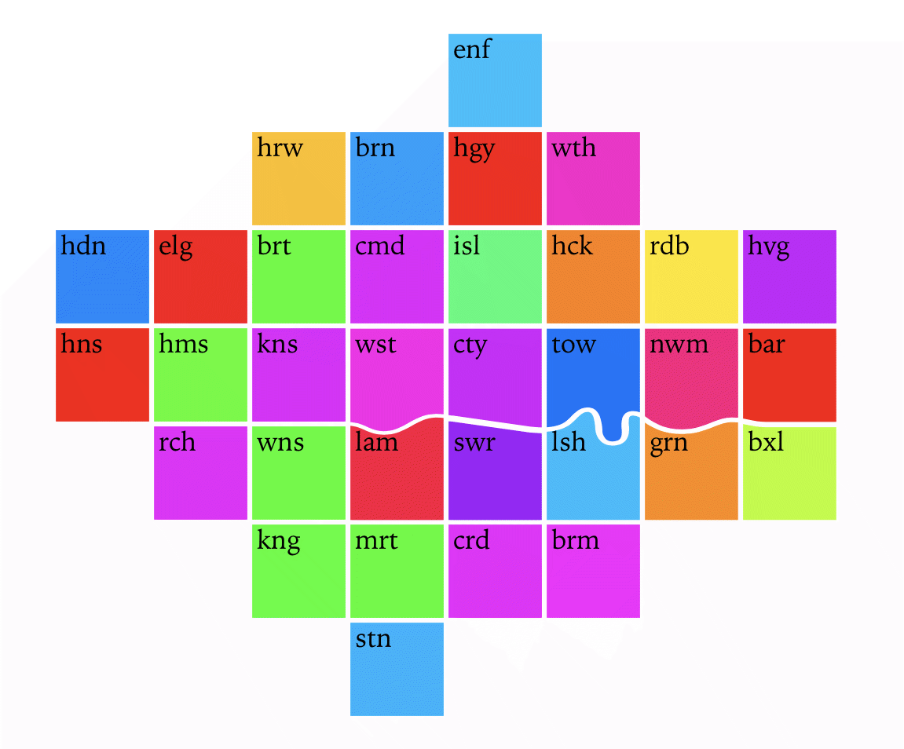

  <h2>London Squared</h2>

  A D3  module to support the creation of <a href="https://aftertheflood.com/projects/future-cities-catapult/">London Squared</a> cartograms.
  <ul>
    <li><a href="/londonsquared/getting-started">Getting started</a></li>
    <li><a href="/londonsquared/api">API documentation</a></li>
  </ul>

<h2 class="full-width">Examples</h2>
  

    <h3><a href="">Putting a map on a page</a></h3>
    
    <ul>
      <li><a href="">Code</a></li>
      <li><a href="https://beta.observablehq.com/@tomgp/london-squared">Observable notebook</a></li>
    </ul>
  

 

  <h3><a href="/londonsquared/site/london-borough-population-now.html">A single variable visualisation</a></h3>
  
  <ul>
    <li><a href="https://github.com/aftertheflood/londonsquared/blob/master/site/london-borough-population-now.html">Code</a></li>
    <li><a href="https://beta.observablehq.com/@tomgp/london-squared-population-map">Observable notebook</a></li>
  </ul>

 

  <a href="http://aftertheflood.github.io/londonsquared/site/london-pcn-data.html">A multi-variable visualisation</a> (<a href="https://github.com/aftertheflood/londonsquared/blob/master/site/london-pcn-data.html">code</a>)

  <a href="http://aftertheflood.github.io/londonsquared/site/london-borough-population-timeline.html">A time series visualization</a> (<a href="https://github.com/aftertheflood/londonsquared/blob/master/site/london-borough-population-interactive.html">code</a>)

  <a href="http://aftertheflood.github.io/londonsquared/site/london-borough-population-interactive.html">Adding some interaction to the time series vizualisation</a> (<a href="https://github.com/aftertheflood/londonsquared/blob/master/site/london-borough-population-interactive.html">code</a>)

  <h2>Developing</h2>
  For local development you can use these npm scripts
  * `npm run build` uses <a href="https://webpack.js.org">webpack</a> to compile the code in the _src_ directory outputting to the _dist_ directory.
  * `npm run serve` runs <a href="https://browsersync.io">browser-sync</a> on the _site_ directory.

