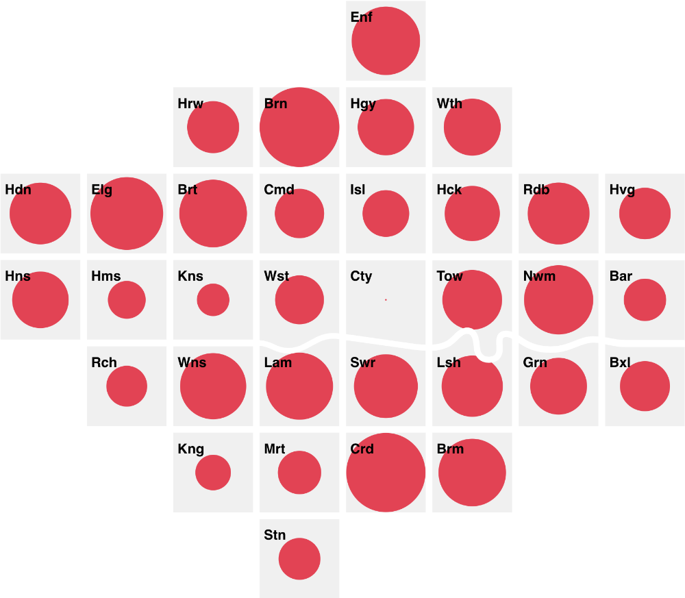
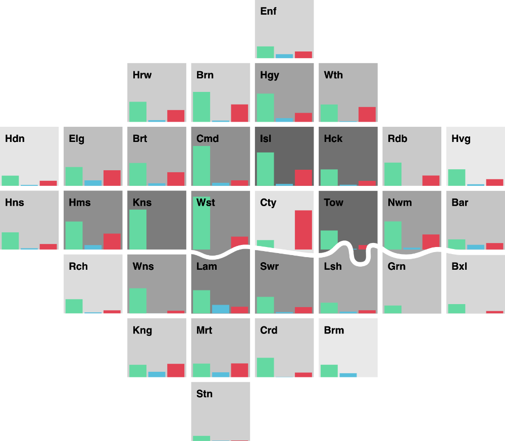
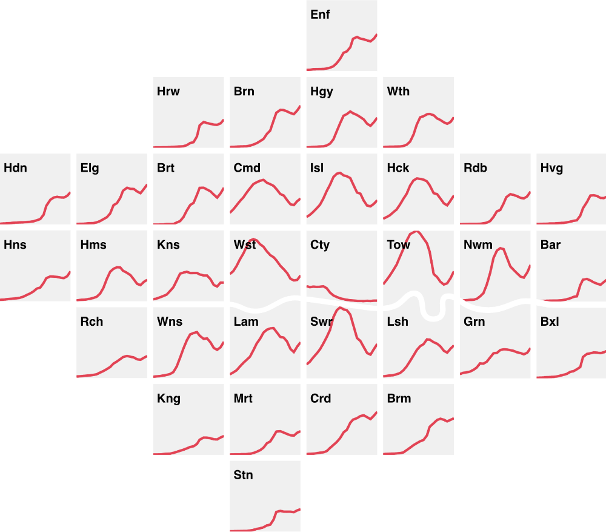
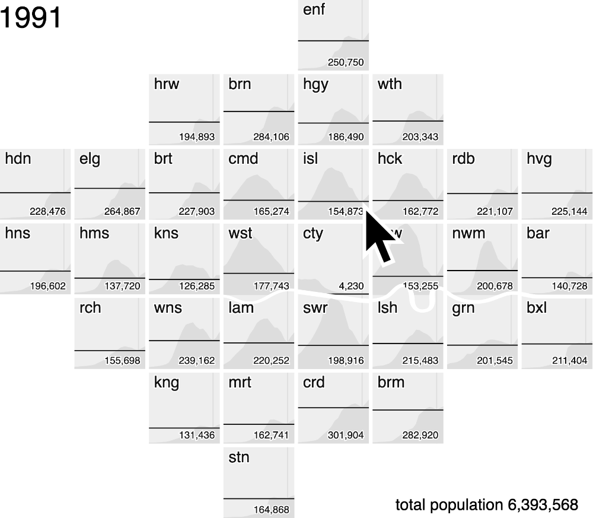
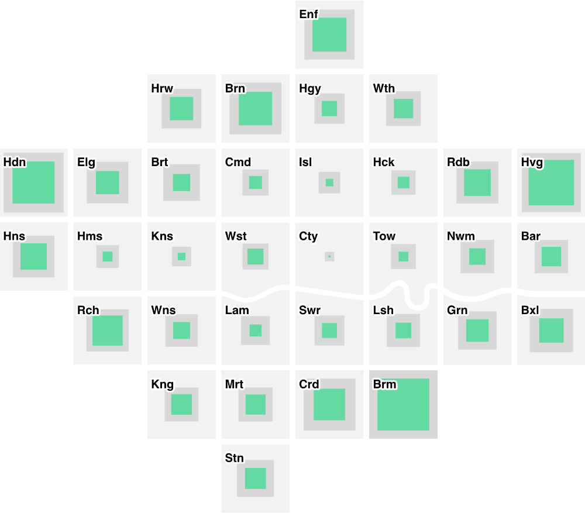

## London Squared

  A D3  module to support the creation of [London Squared](https://aftertheflood.com/projects/future-cities-catapult/) cartograms.
 * [Getting started](/londonsquared/getting-started)
 * [API documentation](/londonsquared/api)

## Examples

  

### Putting a map on a page

 * Code
 * [Observable notebook](https://beta.observablehq.com/@tomgp/london-squared)
 
  

  

### Single variable visualisation

 * [Demo](/londonsquared/site/london-borough-population-now.html)
 * [Code](https://github.com/aftertheflood/londonsquared/blob/master/site/london-borough-population-now.html)
 * [Observable notebook](https://beta.observablehq.com/@tomgp/london-squared-population-map)
 
  

  

### A multi-variable visualisation

 * [Demo](/londonsquared/site/london-borough-population-now.html)
 * [Code](https://github.com/aftertheflood/londonsquared/blob/master/site/london-pcn-data.html)
 * [Observable notebook](https://beta.observablehq.com/@tomgp/london-squared-penalty-charge-map)

  

  

### Time series visualization

 * [Demo](/londonsquared/site/london-borough-population-timeline.html)
 * [Code](https://github.com/aftertheflood/londonsquared/blob/master/site/london-borough-population-timeline.html)
 * [Observable notebook](https://beta.observablehq.com/@tomgp/london-squared-population-timeseries)

  

  

### Adding interaction

 * [Demo](http://aftertheflood.github.io/londonsquared/site/london-borough-population-interactive.html)
 * [Code](https://github.com/aftertheflood/londonsquared/blob/master/site/london-borough-population-interactive.html)

  

  

### Area and greenspace

 * [Observable notebook](https://beta.observablehq.com/@tomgp/london-squared-greenspace-map)

  

