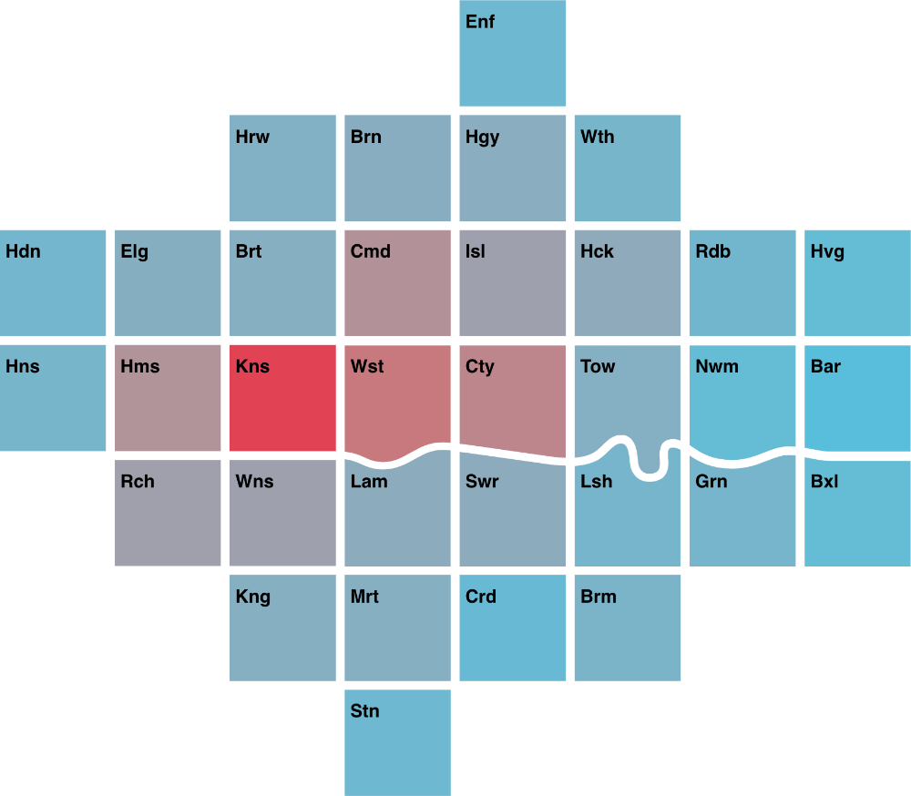

A D3  module to support the creation of [London Squared](https://aftertheflood.com/projects/future-cities-catapult/) cartograms.

 * [Getting started](/londonsquared/getting-started)
 * [API documentation](/londonsquared/api)
 * [More about the thinking behind London Squared](/londonsquared/design-process)
 * [Code on github](https://www.github.com/aftertheflood/londonsquared)

## Examples

  

### Putting a map on a page

 * [Observable notebook](https://beta.observablehq.com/@tomgp/london-squared)
 
  

  

### Single variable visualisation

 * [Demo](/londonsquared/site/london-borough-population-now.html)
 * [Code](https://github.com/aftertheflood/londonsquared/blob/master/site/london-borough-population-now.html)
 * [Observable notebook](https://beta.observablehq.com/@tomgp/london-squared-population-map)
 
  

  

### A multi-variable visualisation

 * [Demo](/londonsquared/site/london-pcn-data.html)
 * [Code](https://github.com/aftertheflood/londonsquared/blob/master/site/london-pcn-data.html)
 * [Observable notebook](https://beta.observablehq.com/@tomgp/london-squared-penalty-charge-map)

  

  

### Time series visualization

 * [Demo](/londonsquared/site/london-borough-population-timeseries.html)
 * [Code](https://github.com/aftertheflood/londonsquared/blob/master/site/london-borough-population-timeseries.html)
 * [Observable notebook](https://beta.observablehq.com/@tomgp/london-squared-population-timeseries)

  

  

### Adding interaction

 * [Demo](http://aftertheflood.github.io/londonsquared/site/london-borough-population-interactive.html)
 * [Code](https://github.com/aftertheflood/londonsquared/blob/master/site/london-borough-population-interactive.html)

  

  

### Area and greenspace

 * [Observable notebook](https://beta.observablehq.com/@tomgp/london-squared-greenspace-map)

  

---

### About us
[After the flood](http://aftertheflood.com/) is a design consultancy based in London. We work with global corporations like Google, Nikkei and Ford to solve business problems that combine our understanding of AI and data as a material with unique user insight. Our consulting model means guaranteed access to our top team. Our approach is user-centred and lean, showing progress to clients and working with a variety of expert partners.
